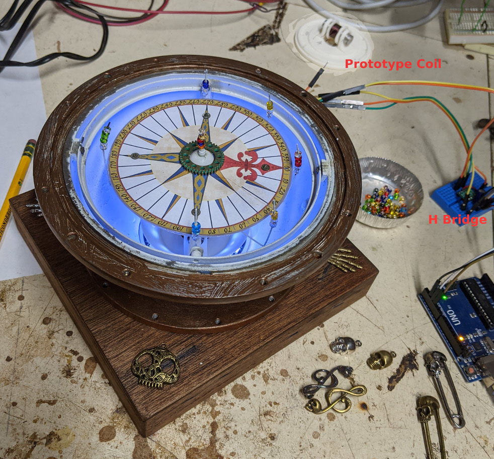
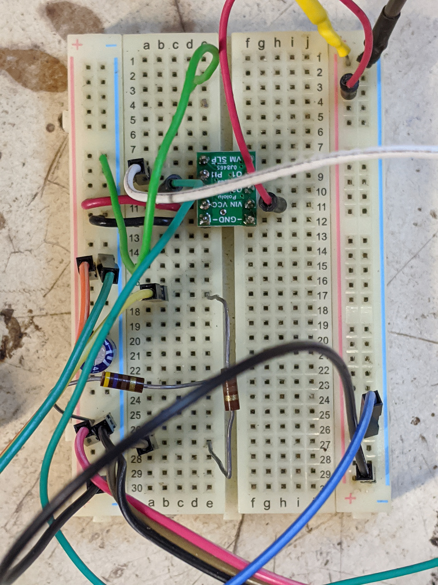

# SparrowCompass

This project began when I was handed a sailboat's 7" compass binacle which had been rescued from a trash heap after a fire. I was impressed that the compass and gimbals still worked in spite of the damage. After some consideration of restoring so it would make a nice desk orniment, someone suggested I should make it more interesting.  I immediately thought of the Jack Sparrow character who carried a compass that told him where he needed to go.  Add some lights and decorations and I knew I had a useful tool even if it doens't exactly match the original hand-held device.

## Plan
The compass was in pretty bad shape. It was a starndard cockpit mounted, fluid filled, compass. It was a pretty old school design consisting of an aluminum lower sphere with a copper spansion base. The base had a window through which a light was used to iluminate the compass. The fire had cracked the window, melted the plastic dome and all of the internal components. The only things that survived were the bronze screws and mica rose platten (though the rose itself was gone.)

I cleaned and repainted the interior and relubricated the gimbal points. I had a NewPixel 24LED ring from another project that was completed and had been going unused.   [View of the Compass in action](https://www.youtube.com/watch?v=ZSw0zdNgRyQ)
All I needed was a way to tweak the compass. I needed it to find the direction we needed to go.  After many experiments with a large array of small motors and steppers (like old CD actuators) I settled on a single hand wound solenoid coil driven by an h-bridge breakout (*Polulu DRV8838 Single Brushed DC Motor Driver Carrier*).  

I completed the decorations by painting the exterior with some bronze paint, mounting it on a customized oak base (properly patina-ed for effect) and allowed for some additional visual improvements. Now I can bring it together in a completed package.  All that is left is the creative elements in software.

## Harware
All of the materials are scraps from other projects or prototypes.  The only real expense was a few dollars for some assorted charms and a plastic dome. (<$20 all in>). I prototyped the softare using an old UNO but transferred the final code to an ATTiny85 with a USB power cable.  I develeoped various devices to control the compass's direction. I tinkered with some old CD stepper actuators with the intent of controlling the specific orientation by swinging a magnet around.  The motion was jumpy and made too much noise. I briefly tinkered with a bipolar motor with a gearing system 3D printed into the base. Again, I wasn't happy with the asthetics and noise.  I settled on a custom solenoid with an iron core oriented E/W. By controlling the duration and strength of the current I could wiggle the compass to cause it to swing wildly. I had an older version of the DRV8838 TI breakout from Polulu but probably could have cobbled a simple transistor amplifier for the coil.  I use software to pulse the magnetic field to create the swings in the compass while adding some light effects aside from the gentle sea background.  

<!--video width="320" height="240" controls>
  <source src="https://www.youtube.com/embed/LiTZkOxYcNE" type="video/mp4">
Your browser does not support the video tag.
</video-->
<!--iframe width="789" height="730" src="https://www.youtube.com/embed/LiTZkOxYcNE" title="YouTube video player" frameborder="0" allow="accelerometer; autoplay; clipboard-write; encrypted-media; gyroscope; picture-in-picture" allowfullscreen></iframe-->

## Software
I used the Sparkfun Neopixel library which has worked well for me in the past. I had to experiment with a variety of color effects to create an ambient soft glow of light reflecting off the surface of a carribean sea.  As mentioned I had to tinker a bit to develop the right kind of pulsing to make a library of gentle wiggles to wild swinging of the compass. Of course any wild deviations from 'normal' orientation had to be accompanied with a bit of a light show as well.  Sound effects? Not currently. I'd have to build an amplifier and figure out how to store and play it back.  Another day perhaps.

